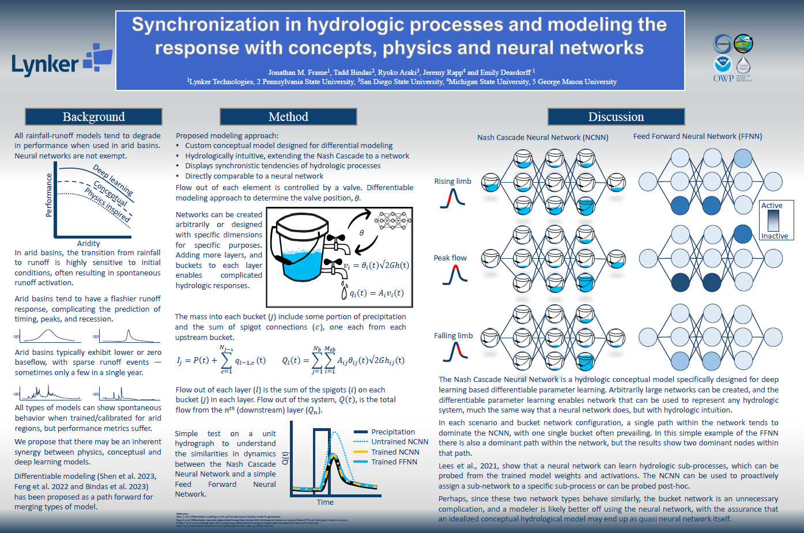

# Nash Cascade Neural Network (NCNN) Project

## Overview
This project focuses on the Nash Cascade Neural Network (NCNN), a hydrologic conceptual model designed for deep learning-based differentiable parameter learning. It aims to represent hydrologic systems intuitively and is inspired by the synchronization of hydrologic processes in modeling using concepts, physics, and neural networks.

## Poster

## Environment Setup
To set up the environment for running the NCNN project, use the provided `environment_cpu.yml` file. This file contains all the necessary dependencies. To create the environment, run the following command:

`conda env create -f environment_cpu.yml`

## Running the Code
The main code for the NCNN project is located in ncn.py. To run the project, launch the Jupyter notebook `nash_cascade_neural_network.ipynb`

## Citation
If you use this project or refer to its findings, please cite the following conference presentation:  

Frame, J. M., Bindas, T., Araki, R., Rapp, J., & Deardorff, E. (2023). On the spontaneous synchronization of hydrologic processes and hydrologic modeling. American Geophysical Union Fall Meeting 2023, session NG21B-0620.

## Contributers
 - Jonathan M. Frame (Lynker Technologies)
 - Tadd Bindas
 - Ryoko Araki
 - Jeremy Rapp
 - Emily Deardorff